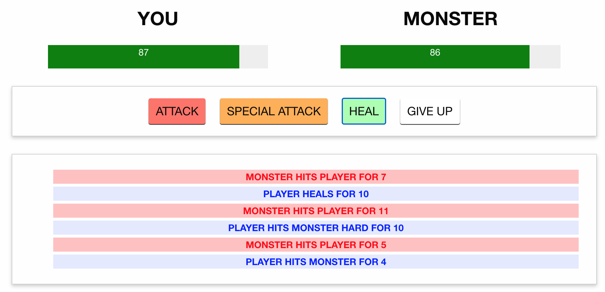
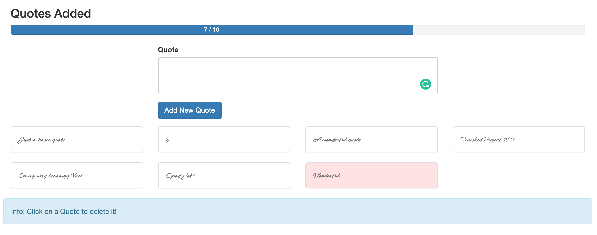
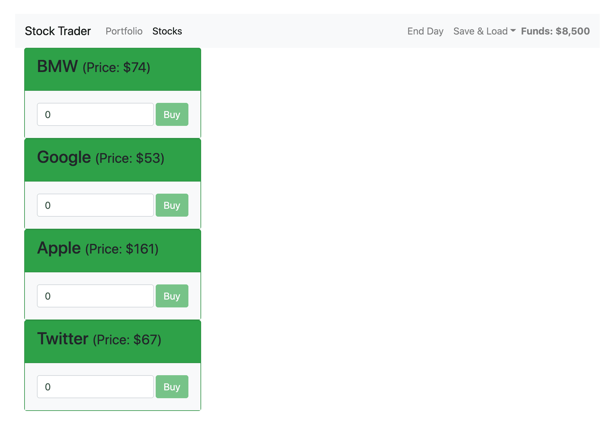
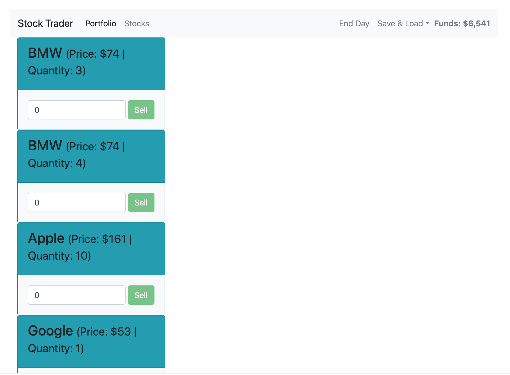

# vuejs2-udemy

https://www.udemy.com/course/vuejs-2-the-complete-guide/

## Projects

### Monster Brawler

Covers sections 1 - 3

TODO - update with animations

### Wonderful Quotes

Covers sections 5 - 9

### Stock Trader

Covers sections 11 - 17.

Use Vue Developer Tools: https://github.com/vuejs/vue-devtools for better debugging.

Deployed at: https://stock-trader-brandon.surge.sh/

## Sections

### Section 1: Getting Started

VueJS Installation: https://vuejs.org/v2/guide/installation.html

### Section 2: Using VueJS to Interact with DOM

Copy code to JSFiddle to run

Guide: https://vuejs.org/v2/guide/

Template Syntax: https://vuejs.org/v2/guide/syntax.html

Events: https://vuejs.org/v2/guide/events.html

Computed Properties and Watchers: https://vuejs.org/v2/guide/computed.html

Class and Style Binding: https://vuejs.org/v2/guide/class-and-style.html

### Section 3: Conditionals and Rendering Lists

Conditionals: https://vuejs.org/v2/guide/conditional.html

Lists: https://vuejs.org/v2/guide/list.html

### Section 5: Understanding VueJS Instance

Vue Instance: https://vuejs.org/v2/guide/instance.html

### Section 6: Moving to real development Worflow with `vue-cli`

### Section 7: Introduction to Components

Components: https://vuejs.org/v2/guide/components.html

Component Registration: https://vuejs.org/v2/guide/components-registration.html

### Section 8: Communicating between Components

props, validating, callback, child => parent communication, child => child communication

Props: https://vuejs.org/v2/guide/components.html#Passing-Data-to-Child-Components-with-Props

Custom Events: https://vuejs.org/v2/guide/components.html#Listening-to-Child-Components-Events

Non-Parent-Child Communication: https://vuejs.org/v2/guide/state-management.html

### Section 9: Advanced Component Usage

Slots and Dynamic Components

Slots: https://vuejs.org/v2/guide/components.html#Content-Distribution-with-Slots

Dynamic Components: https://vuejs.org/v2/guide/components.html#Dynamic-Components

Misc: https://vuejs.org/v2/guide/components-edge-cases.html

### Section 11: Handling User Input with Forms

v-model, input & select tags, forms

Forms: https://vuejs.org/v2/guide/forms.html

### Section 12: Understanding Directives

global and local custom directives

Custom Directives: https://vuejs.org/v2/guide/custom-directive.html

### Section 13: Filters and Mixins

Filters: https://vuejs.org/v2/guide/filters.html

Mixins: https://vuejs.org/v2/guide/mixins.html

### Section 14: Animations

Animate CSS: https://animate.style/

### Section 15: vue-resource

vue-resource on Github: https://github.com/yyx990803/vue-resource

Some Code Recipes for vue-resource: https://github.com/yyx990803/vue-resource/blob/master/docs/recipes.md

Template URLs: https://medialize.github.io/URI.js/uri-template.html

Requests and Responses (incl. Different File Formats): https://github.com/yyx990803/vue-resource/blob/master/docs/http.md

Axios is really recommended instead of using this vue-resource.

### Section 16: Routing

vue-router Github Page: https://github.com/vuejs/vue-router

vue-router Documentation: https://router.vuejs.org/en/

### Section 17: Vuex

Vuex Github Page: https://github.com/vuejs/vuex

Vuex Documenation: https://vuex.vuejs.org/en/

### Section 19: Deployment

Tutorial uses AWS S3. However, I think surge.sh is easier.

Run:

- `npm run build`
- `npm install -g surge`
- `cd dist`
- `surge`

Then, you should have a URL to access your site.

OR:

Run: `npm run deploy`, which has a script to deploy to the URL that I want.

Go to https://stock-trader-brandon.surge.sh/ to see Project 3.

Vue Deployment: https://cli.vuejs.org/guide/deployment.html

### Section 22: Using Axios

Axios: https://github.com/axios/axios
